# Learning-Python-Gtk3
Learning to build GUI apps for desktops using python.

## 01_Basic_Gtk
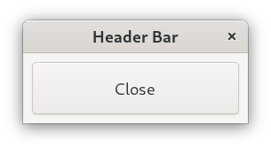

## 02_Gtk_label
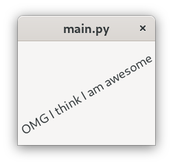

## 03_Gtk_Box_and_Buttons
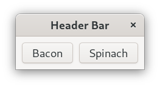

## 04_Gtk_Buttons_Sizing_and_Positioning
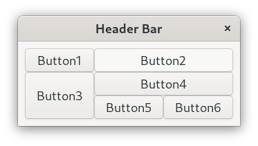

## 05_Gtk_ListBox
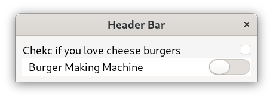

## 06_Gtk_Stack

## 07_Gtk_Header_bar
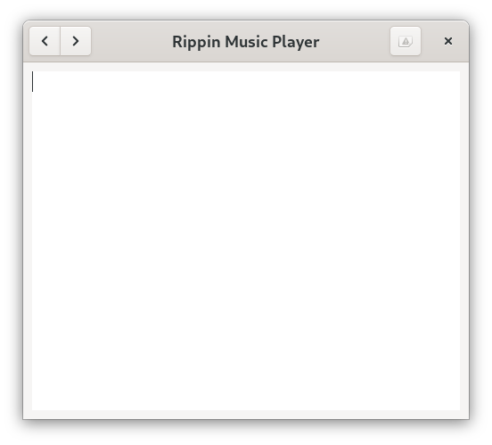

## 08_Gtk_Tabs
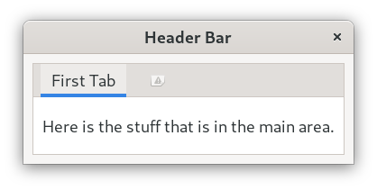

## 09_Gtk_Box_Positioning
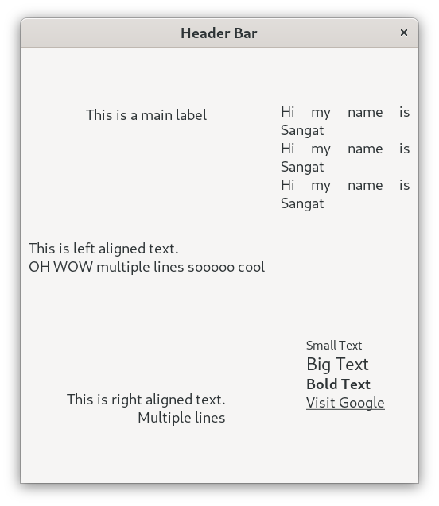

## 10_Gtk_Input
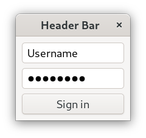

## 11_Gtk_TreeView
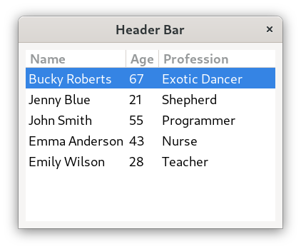

## 12_Tree_view_Selection_of_Items
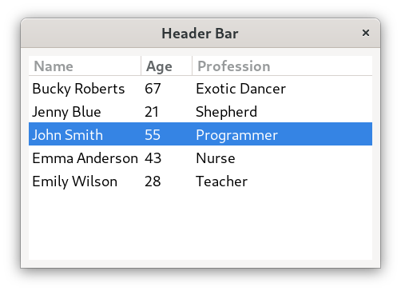

## 13_Gtk_File_Menu_Dropdown
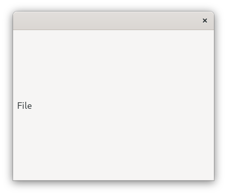

## 14_Gtk_popup
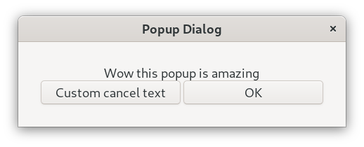

## 15_Opening_Files
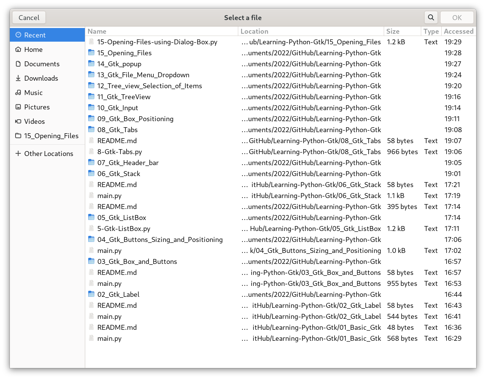

