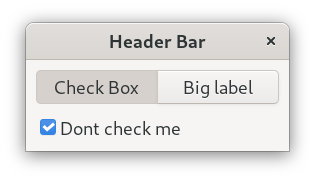

# Learning-Python-Gtk3
Learning to build GUI apps for desktops using python.

## 01_Basic_Gtk

## 02_Gtk_label

## 03_Gtk_Box_and_Buttons

## 04_Gtk_Buttons_Sizing_and_Positioning

## 05_Gtk_ListBox

## 06_Gtk_Stack

## 07_Gtk_Header_bar

## 08_Gtk_Tabs

## 09_Gtk_Box_Positioning

## 10_Gtk_Input

## 11_Gtk_TreeView

## 12_Tree_view_Selection_of_Items

## 13_Gtk_File_Menu_Dropdown

## 14_Gtk_popup

## 15_Opening_Files

